# Jhri's Dotfiles for hyprland Arch Linux
> This project is a minimal, clean and beautiful configuration of the Hyprland TWM in Arch Linux. 

### My dotfiles aim to be as clean, pleasing and keyboard focused as possible. Here are some of the key features! 
- **Fully Keyboard Based**: From the browser to the IDE, everything can be navigated through using the keyboard with the most up-to-date apps and terminal.
- **Customizable**: Becuase these dotfiles use hyprland, everything from keyboard shortcuts to themes can be customized. You would mainly find this in the ~/.config/hyprland folder but check the other folders for other specific settings.
- **Theme**: Everything uses the Catppuccin theme, giving the whole system a clean pastel look!

### Screenshots

 
 

 
Screenshot 1

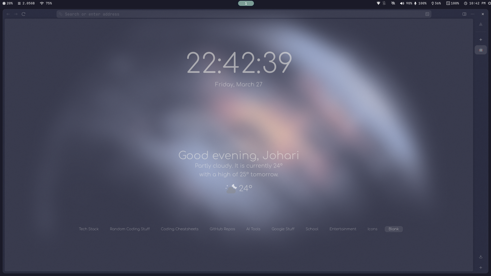

 
Screenshot 2

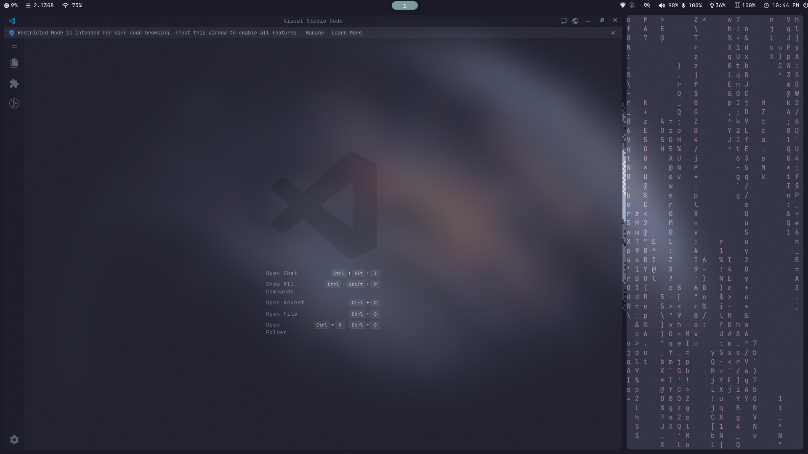

 
Screenshot 3

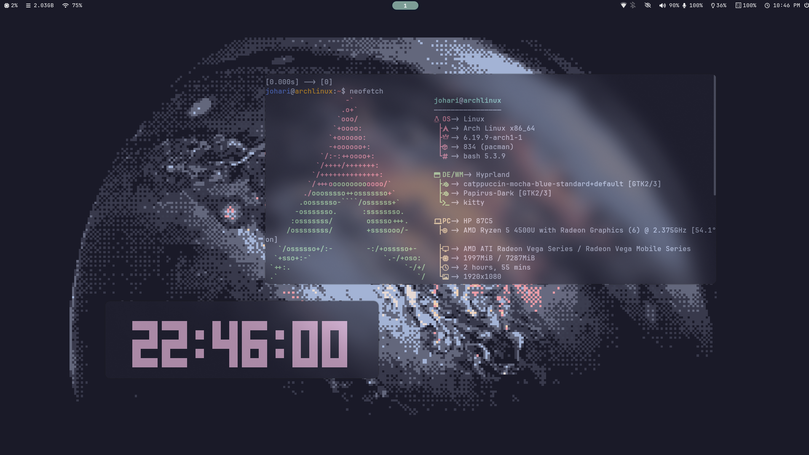

 
Screenshot 4

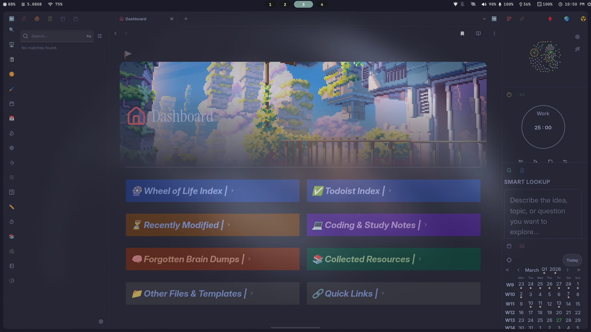

 
Screenshot 5

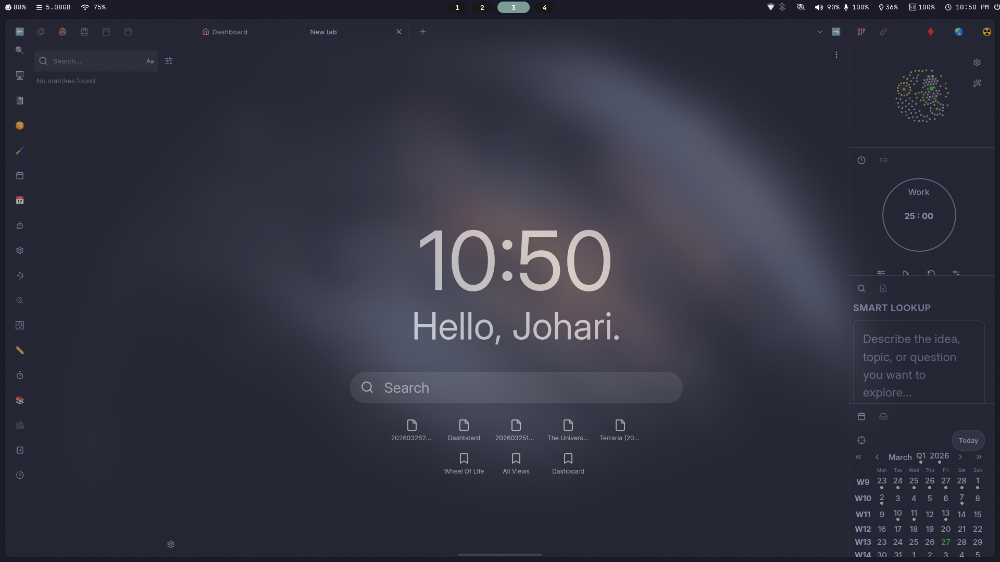

 
Screenshot 6

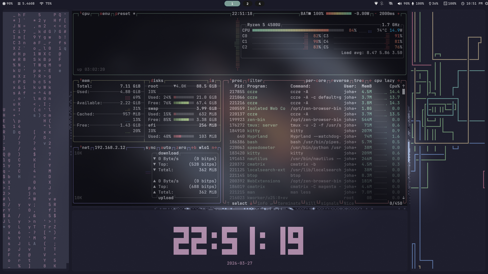

 
Screenshot 7

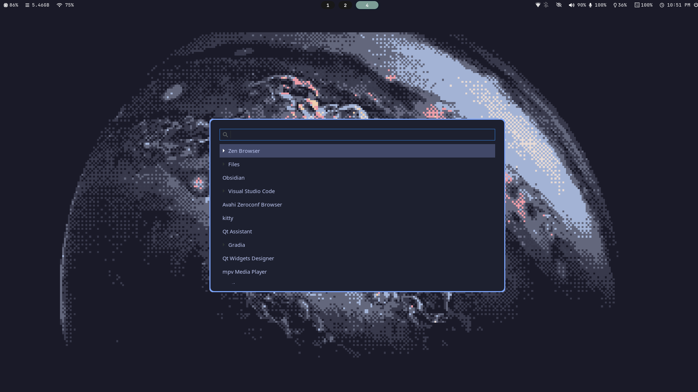

 
Screenshot 8

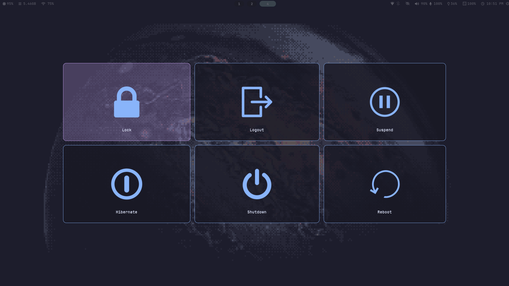

 
Screenshot 9

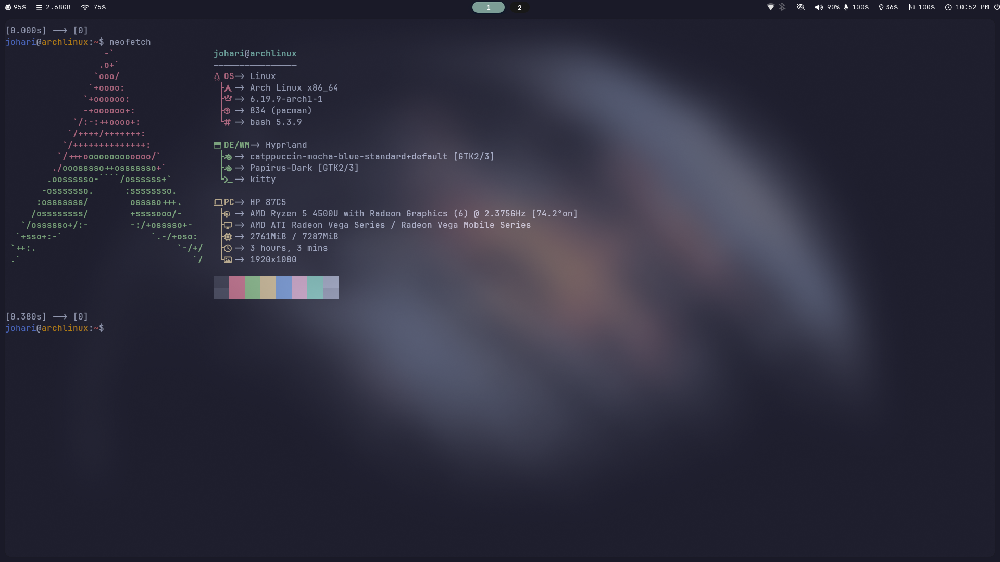

 
Screenshot 10

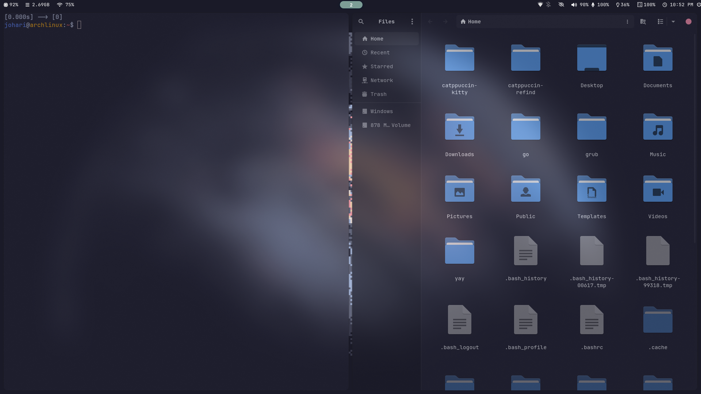

 
Screenshot 11

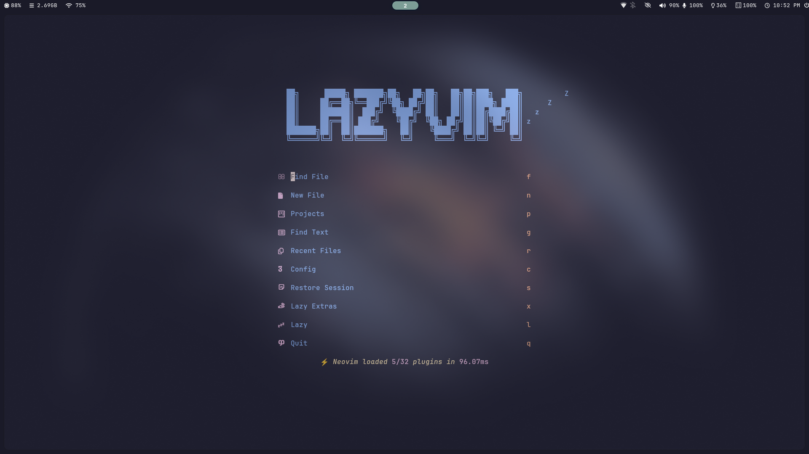

 
Screenshot 12

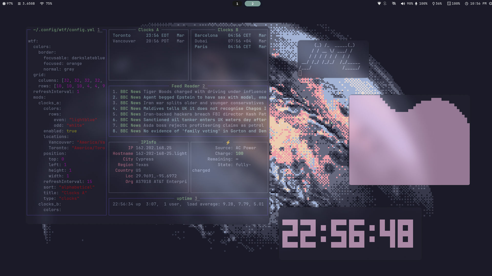

 
Screenshot 13

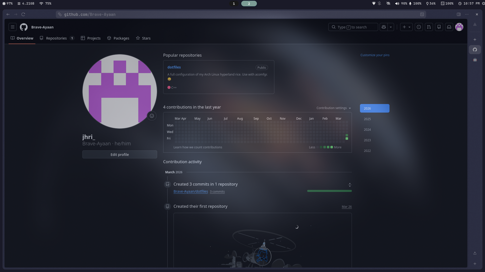

 
Screenshot 14

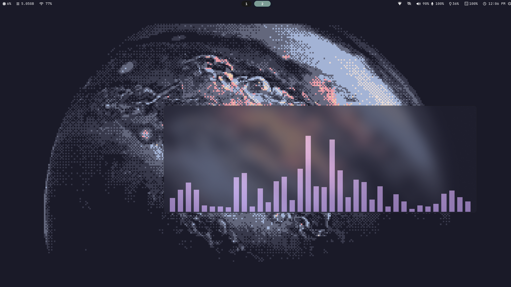

 
Screenshot 15

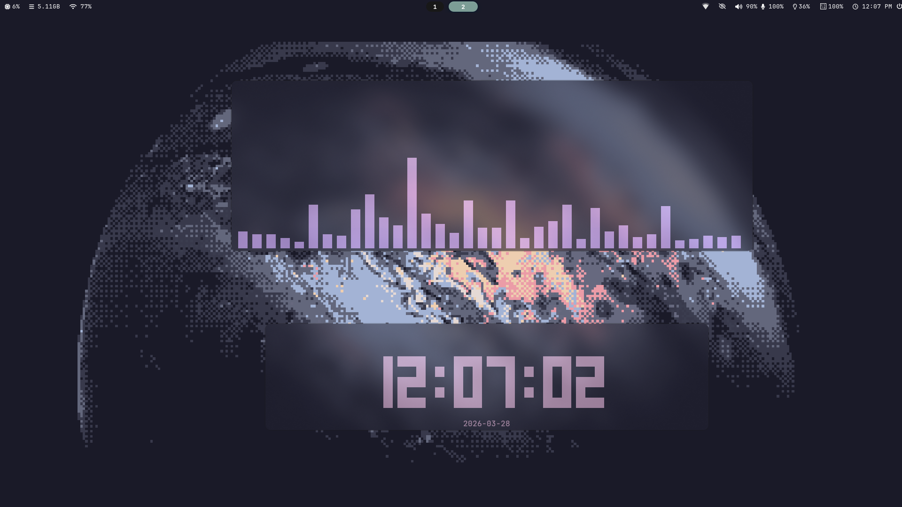

 
Screenshot 16

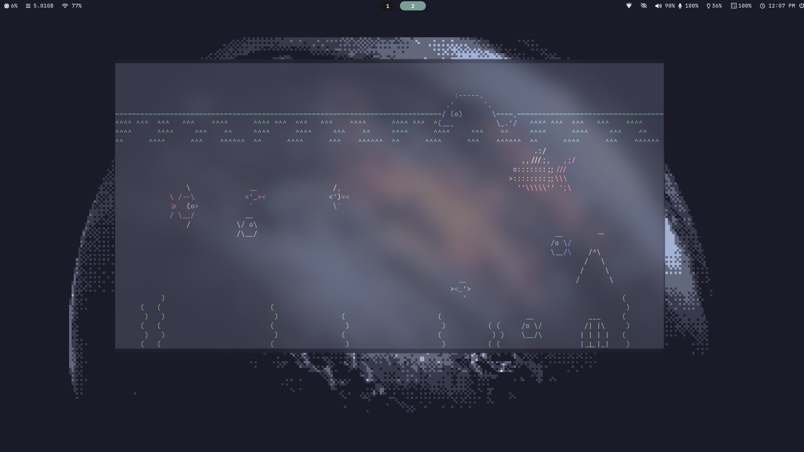

 
Screenshot 17

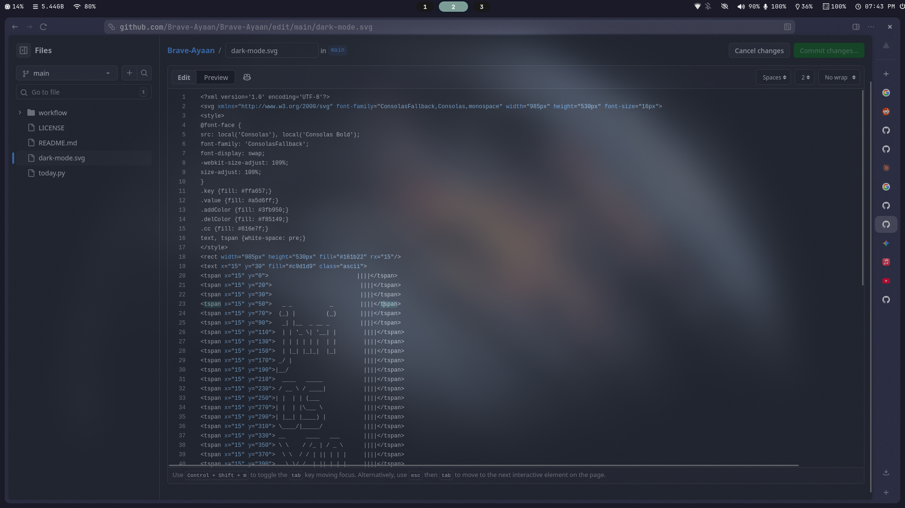

 
Screenshot 18

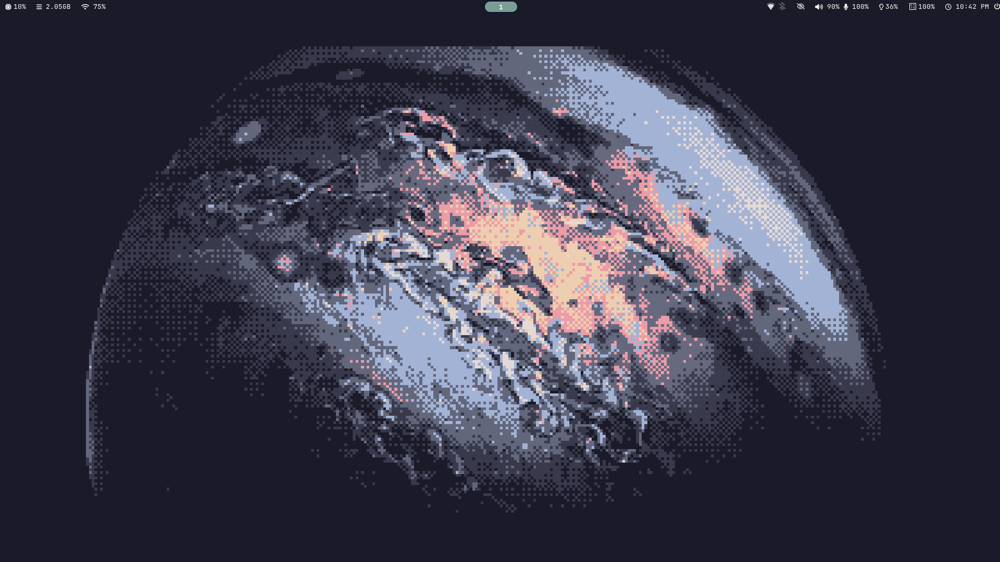

<a href="https://www.star-history.com/?repos=Brave-Ayaan%2Fdotfiles&type=date&legend=top-left">
 <picture>
   <source media="(prefers-color-scheme: dark)" srcset="https://api.star-history.com/image?repos=Brave-Ayaan/dotfiles&type=date&theme=dark&legend=top-left" />
   <source media="(prefers-color-scheme: light)" srcset="https://api.star-history.com/image?repos=Brave-Ayaan/dotfiles&type=date&legend=top-left" />
   
 </picture>
</a>
